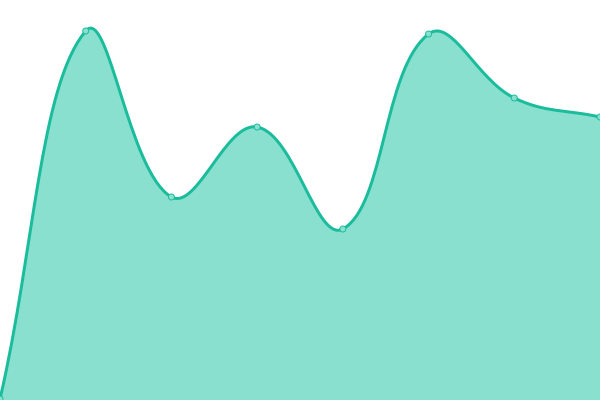

# [📈 Live Status](https://Dataseed-inc.github.io/status-page): <!--live status--> **🟩 All systems operational**

This repository contains the open-source uptime monitor and status page for [Dataseed](https://dataseed.jp/), powered by [Upptime](https://github.com/upptime/upptime).

With [Upptime](https://upptime.js.org), you can get your own unlimited and free uptime monitor and status page, powered entirely by a GitHub repository. We use [Issues](https://github.com/Dataseed-inc/status-page/issues) as incident reports, [Actions](https://github.com/Dataseed-inc/status-page/actions) as uptime monitors, and [Pages](https://Dataseed-inc.github.io/status-page) for the status page.

<!--start: status pages-->
<!-- This summary is generated by Upptime (https://github.com/upptime/upptime) -->
<!-- Do not edit this manually, your changes will be overwritten -->
<!-- prettier-ignore -->
| URL | Status | History | Response Time | Uptime |
| --- | ------ | ------- | ------------- | ------ |
|  [Dataseed website](https://www.dataseed.jp) | 🟩 Up | [dataseed-website.yml](https://github.com/Dataseed-Inc/status-page/commits/HEAD/history/dataseed-website.yml) | 

 221ms
     
 | 

<a href="https://status.dataseed.jp/history/dataseed-website">100.00%</a>
    

|  [Dataseed application](https://test.dataseed.jp) | 🟩 Up | [dataseed-application.yml](https://github.com/Dataseed-Inc/status-page/commits/HEAD/history/dataseed-application.yml) | 

 3323ms
     
 | 

<a href="https://status.dataseed.jp/history/dataseed-application">99.84%</a>
    

|  [Dataseed API](https://api.dataseed.jp/docs) | 🟩 Up | [dataseed-api.yml](https://github.com/Dataseed-Inc/status-page/commits/HEAD/history/dataseed-api.yml) | 

 283ms
     
 | 

<a href="https://status.dataseed.jp/history/dataseed-api">100.00%</a>
    

<!--end: status pages-->

[**Visit our status website →**](https://Dataseed-inc.github.io/status-page)

## 📄 License

- Powered by: [Upptime](https://github.com/upptime/upptime)
- Code: [MIT](./LICENSE) © [Dataseed](https://dataseed.jp/)
- Data in the `./history` directory: [Open Database License](https://opendatacommons.org/licenses/odbl/1-0/)
